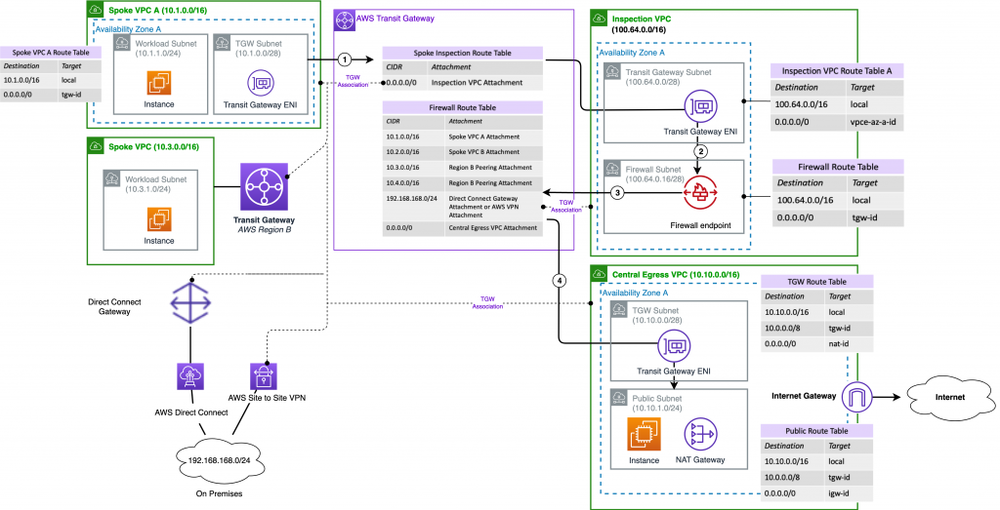

# Serverless Egress Test

Implements this architecture:

source: [link](https://aws.amazon.com/blogs/networking-and-content-delivery/deployment-models-for-aws-network-firewall/)

With a key difference, we use Lambda in the workload subnet, instead of an EC2 instance

## Deployment

    $ cd terraform
    $ tf deploy --auto-approve

## Deploy Lamda

    $ cd serverless
    $ sls deploy

# Deletion

    $ cd serverless
    $ sls remove
    $ cd ../terraform
    $ tf destroy --auto-approve

